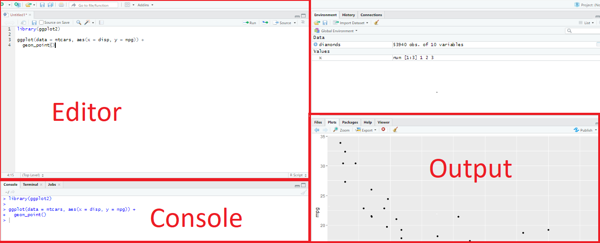

layout: true

<div class="my-footer"><span>

<a href="https://www.meetup.com/pt-BR/R-Ladies-Vitoria">Meetup</a> |
<a href="https://twitter.com/rladiesvix">Twitter</a> | 
<a href="http://instagram.com/rladiesvix">Instagram</a> |
<a href="https://github.com/rladies/meetup-presentations_vitoria">Github</a> 


</span></div> 

```{r setup, include=FALSE}
knitr::opts_chunk$set(echo = FALSE, fig.align = "center", message = FALSE, 
                      warning = FALSE, comment = "  #>", collapse = T)
```

<!-- programação -->
---
class: middle 

# Programação 

- R-Ladies

- Introdução ao R

- R básico

- Importação de dados

- Tratamento de dados

- Medidas descritivas

<!-- R-Ladies -->
---
class:  center

```{r, out.width="18%", fig.cap="<center><b> </center></b>"}
knitr::include_graphics("img/hexlogorladies.jpeg")
```


- R-Ladies é uma organização mundial que **promove a diversidade de gênero** na comunidade R.

- Capacitar pessoas de gêneros sub-representados, criando e fortalecendo redes colaborativas dentro da comunidade R para que elas alcancem todas e quaisquer funções e áreas de participação no mundo da tecnologia.


**Como**

* Promovendo meetups (encontros) e mentorias. 

* Garantindo espaço amigável e seguro. 

---
class:  center

```{r, out.width="40%", fig.cap="<center><b> </center></b>"}

```

O Capítulo da cidade de Vitória foi criado em 29 de setembro de 2019.


- [Código de conduta - R-Ladies](https://github.com/rladies/starter-kit/wiki/Code-of-Conduct#portuguese)


- Saiba mais:
  - RLadies Global: [https://rladies.org/](https://rladies.org/)
  - MeetUp: [https://www.meetup.com/pt-BR/R-Ladies-Vitoria](https://www.meetup.com/pt-BR/R-Ladies-Vitoria)
  - Twitter: [@RLadiesGlobal](https://twitter.com/rladiesglobal), [@rladiesvix](https://twitter.com/rladiesvix)
  - Instagram: [@RLadiesVix](http://instagram.com/rladiesvix)
  - Github: [https://github.com/rladies/meetup-presentations_vitoria](https://github.com/rladies/meetup-presentations_vitoria)


<!-- R -->
---
class: center


```{r, out.width="25%", fig.cap="<center><b> </center></b>"}
knitr::include_graphics("img/R_logo.svg.png")
```


- O R é uma linguagem de programação, além de um ambiente de software gratuito. 

- oferece um vasto leque de funcionalidades acessíveis via instalação de bibliotecas.


- o R possui uma comunidade extremamente ativa, engajada desde o aprimoramento da ferramenta e desenvolvimento de novas bibliotecas, até o suporte aos usuários.


- Saiba mais em: [r-project.org](https://www.r-project.org/about.html) 


---
class: middle

```{r, out.width="45%", fig.cap="<center><b> </center></b>"}
knitr::include_graphics("img/rstudio.png")
```
- Optar por programar em R também implica na escolha de uma IDE (Integrated Development Environment) que, na grande maioria dos casos, será o RStudio.

- O RStudio é um conjunto de ferramentas integradas projetadas (IDE - Integrated Development Environment) da linguagem R para editar e executar os códigos em R.

- O R, em combinação com o RStudio, possui um conjunto de funcionalidades cuja intenção é ajudar no processo de desenvolvimento.


- Saiba mais em: [https://rstudio.com/](https://rstudio.com/) 


---
class: middle

# RStudio

```{r, out.width="100%", fig.cap="<center><b> </center></b>"}

```
---
class: middle

# RStudio


* Editor/Scripts: É onde escrever os códigos. Arquivos do tipo .R. 

* Console: Executar os comandos e ver os resultados. 

* Enviroment: Painel com todos os objetos criados.

* History: História dos comandos executados. 

* Files: Navegar em pastas e arquivos. 

* Plots: Onde os gráficos serão apresentados.

* Packages: Pacotes instalados (sem ticar) e habilitados (ticados). 

* Help: Retorna o tutorial de ajuda do comando solicitado com help() ou ?comando. Veremos melhor como pedir ajuda no R ainda nessa aula. 


---
class: middle

# Rproj e diretórios
- Organizar arquivos é uma parte integral do processo de programação.

- Denominados “projetos”, eles não passam de pastas comuns com um arquivo .Rproj.


Uma funcionalidade importante é a criação de projetos, permitindo dividir o trabalho em múltiplos ambientes, cada um com o seu diretório, documentos e workspace.

Para criar um projeto, os seguintes passos podem ser seguidos:

1) Clique na opção “File” do menu, e então em “New Project”.

2) Clique em “New Directory”.

3) Clique em “New Project”.

4) Escreva o nome do diretório (pasta) onde deseja manter seu projeto, ex “my_project”.

5) Clique no botão “Create Project”.

Para criar um novo script para escrever os códigos, vá em File -> New File -> R Script

---
class: middle

# Boas práticas

- Comente bem o seu código: É possível fazer comentários usando o símbolo ‘#’. É sempre bom explicar o que uma variável armazena, o que uma função faz, porque alguns parâmetros são passados para uma determinada função, qual é o objetivo de um trecho de código, etc.

- Evite linhas de código muito longas: Usar linhas de código mais curtas ajuda na leitura do código.

- Escreva um código organizado: Por exemplo, adote um padrão no uso de minúsculas e maiúsculas, uma lógica única na organização de pastas e arquivos, pode ser adotada uma breve descrição (como comentário) indicando o que um determinado script faz.

- Carregue todos os pacotes que irá usar sempre no início do arquivo: Quando alguém abrir o seu código será fácil identificar quais são os pacotes que devem ser instalados e quais dependências podem existir.

- Evite referência de caminho que considere seu computador ou usuário: Faça referência ao caminho do projeto.

---
class: middle

# Shall we?

```{r, out.width="40%", fig.cap="<center><b>Ilustração por Allison Horst - Twitter: <a href='https://twitter.com/allison_horst/'> @allison_horst</a> </b></center>"}

```

---
class: middle

### R como calculadora 

<!-- 1) Operadores -->

```{r calc1, echo=TRUE,eval=TRUE,include=TRUE}
#adição
10+15
#subtração
10-2
#multiplicação
2*10
#divisão
30/2
#raiz quadrada
sqrt(4)
#potência
2^2
```
Se você digitar um comando incompleto, como 10 *, o R mostrará um +. Isso não tem a ver com a soma e apenas que o R está esperando você completar seu comando. Termine seu comando ou aperte Esc para recomeçar. 
<!-- Vale também ressaltar que se você digitar um comando que o R não reconhece, ele retornará uma mensagem de erro e você pode digitar outro comando normalmente em seguida.  -->

---
class: middle

### Atribuição 

Para atribuir a um objeto, o sinal de atribuição é = ou <-. 
Exemplos:
```{r, eval=TRUE,include=TRUE,echo=TRUE,error=TRUE}
x <- 10/2
x
X
```
Por que tivemos um erro acima?

--

O R é case sensitive, isto é, faz a diferenciação entre as letras minúsculas e maiúsculas. Portanto, x é diferente de X. 

---
class: middle

### Objetos em R

Existem cinco classes básicas no R:

* character: "UAH!" 

* numeric: 0.95 (números reais)

* integer: 100515 (inteiros)

* complex: 2 + 5i (números complexos, a + bi)

* logical: TRUE (booleanos, TRUE/FALSE)

---
class: middle

Vamos atribuir a x a string banana. 
```{r, eval=TRUE,include=TRUE,echo=TRUE,error=TRUE}
x <- banana 
x <- "banana"
x
```
O primeiro caso (x<-banana) não deu certo, pois ele entendeu que estamos atribuindo a x outro objeto banana, que não foi declarado. Para atribuir o string banana à x, precisamos colocar entre aspas ou aspas simples. Uma string sem aspas é entendido como um objeto, veja abaixo:
```{r, eval=TRUE,include=TRUE,echo=TRUE,error=TRUE}
banana <- 30
x <- banana
x
```


---
class: middle

Função class().

```{r, eval=TRUE,include=TRUE,echo=TRUE,error=TRUE}
y <- "ola"
class(y)

x <- 2.5
class(x)
```

Apagar objetos

```{r, eval=TRUE,include=TRUE,echo=TRUE,error=TRUE}
x <- 20
x
remove(x)
x
```

E se eu quiser limpar o console - apaga todos os objetos atribuidos até aqui:
```{r, eval=TRUE,include=TRUE,echo=TRUE,error=TRUE}
rm(list=ls())
```

---
class: middle

### Data Strutures
* atomic vector

* matrix

* factors

* data frame

* list
---
class: middle

### Vetor
 <!-- Como atribuir varios valores a um objeto?  Para entrar com vários números (ou nomes, ou qualquer outro grupo de coisas), precisamos usar uma função para dizer ao programa que os valores serão combinados em um único vetor. -->
```{r, eval=TRUE,include=TRUE,echo=TRUE,error=TRUE}
x <- c(2,3,4)
x
y <- seq(1:10)
y
z <- rep(1,10)
z
a <- 1:10
a
bicho <-c("macaco","pato","galinha","porco")
bicho
```
E se quisermos visualizar o conteúdo da posição 2 no vetor bicho?
```{r, eval=TRUE,include=TRUE,echo=TRUE,error=TRUE}
bicho[2]
```


---
class: middle

Operações vetoriais

```{r, eval=TRUE,include=TRUE,echo=TRUE,error=TRUE}
k <- x*2
y <- c(x,k)
y
```
<!-- Vale mencionar que o separador de decimais no R é . (ponto)!  -->

Como calcularia o IMC de 6 pessoas?
--

```{r, eval=TRUE,include=TRUE,echo=TRUE,error=TRUE}
peso <- c(62, 70, 52, 98, 90, 70)
altura <- c(1.70, 1.82, 1.75, 1.94, 1.84, 1.61)
imc <- peso/(altura^2)
imc
```

Função length(). 
```{r, eval=TRUE,include=TRUE,echo=TRUE,error=TRUE}
length(imc)
```

---
class: middle

### Matrizes
```{r, eval=TRUE,include=TRUE,echo=TRUE,error=TRUE}
x <- matrix(seq(1:16), nrow=4,ncol=4)
x
x[2,3] #retorna o elemento na segunda linha e terceira coluna da matriz
x[3,  ]   # seleciona a 3ª linha
x[ , 2]   # seleciona a 2ª coluna
x[1,] <- c(13,15,19,30)  #substituir a primeira linha por (13,15,19,30)

x
```
dimensao da matriz x?
```{r, eval=TRUE,include=TRUE,echo=TRUE,error=TRUE}
dim(x)
```
---
class: middle

Concatenar linhas em uma matriz
```{r, eval=TRUE,include=TRUE,echo=TRUE,error=TRUE}
vet <- c(2,20,12,34)
x2 <- rbind(x,vet)
x2
```

Concatenar colunas em uma matriz
```{r, eval=TRUE,include=TRUE,echo=TRUE,error=TRUE}
v2 <- c(25,10,15,4) 
x3 <- cbind(x,v2)
x3
```


---
class: middle

Operações matriciais
```{r, eval=TRUE,include=TRUE,echo=TRUE,error=TRUE}
xa <- x2[1:2,1:2]
xb <- matrix(rnorm(4),2,2)
xa*xb #multiplicacao ponto a ponto
xa%*%xb #multiplicacao matricial
solve(xa) #inversa de xa
diag(xa) #matriz diagonal
```

---
class: middle

### Data frame
Trata-se de uma “tabela de dados” onde as colunas são as variáveis e as linhas são os registros. Essas colunas podem ser de classes diferentes. 
Essa é a grande diferença entre data.frame’s e matrizes (matriz é só numerica).

Posso criar um data frame no R com os vetores, por exemplo:
```{r, eval=TRUE,include=TRUE,echo=TRUE,error=TRUE}
ID <- seq(1:6)
pes <- c(62, 70, 52, 98, 90, 70)
alt <- c(1.70, 1.82, 1.75, 1.94, 1.84, 1.61)
imc <- pes/(alt^2)
dados <- data.frame(ID=ID,peso=pes,altura=alt, imc=imc)
dados
```

---
class: middle

Selecionar a variavel de interesse:
```{r, eval=TRUE,include=TRUE,echo=TRUE,error=TRUE}
dados$altura
```

Putz, esqueci de colocar a varivel de grupo no data frame. Tenho que criar tudo de novo? Não:
```{r, eval=TRUE,include=TRUE,echo=TRUE,error=TRUE}
gr <- c(rep(1,3),rep(2,3))
dados$grupo <- gr

dados
```

---
class: middle

Funcoes uteis para data.frame:

* head() - Mostra as primeiras 6 linhas.

* tail() - Mostra as últimas 6 linhas.

* dim() - Número de linhas e de colunas.

* names() - Os nomes das colunas (variáveis).

* str() - Estrutura do data.frame. Mostra, entre outras coisas, as classes de cada coluna.


```{r, eval=TRUE,include=TRUE,echo=TRUE,error=TRUE}
names(dados)
str(dados)
```

---
class: middle

```{r, eval=TRUE,include=TRUE,echo=TRUE,error=TRUE}
mean(dados$imc)
sd(dados$imc)
summary(dados$imc)
```

```{r, eval=TRUE,include=TRUE,echo=TRUE,error=TRUE}
table(dados$grupo)
```

---
class: middle

### Fator
<!-- Fatores podem ser vistos como vetores de inteiros que possuem rótulos (labels). Eles são úteis para representar uma variável categórica (nominal e ordinal). -->

```{r, eval=TRUE,include=TRUE,echo=TRUE,error=TRUE}
sexo <- c("M", "H", "H", "H", "M", "M", "H")
sex <- as.factor(sexo)
sex
levels(sex)
```

---
class: middle

### Arrays
```{r, eval=TRUE,include=TRUE,echo=TRUE,error=TRUE}
dim3 <- array(rnorm(18),dim = c(3,3,2))
dim3
```

---
class: middle

### Lists
```{r, eval=TRUE,include=TRUE,echo=TRUE,error=TRUE}
ls <- list(ls1 = 'a',ls2 = c(1,2,3),ls3 = array(rnorm(6),dim = c(3,1,2,1)))
ls
```

---
class: middle

## Operadores Relacionais
Igual a: ==

```{r, eval=TRUE,include=TRUE,echo=TRUE,error=TRUE}
10==11
```

Diferente de: !=

```{r, eval=TRUE,include=TRUE,echo=TRUE,error=TRUE}
10!=11
```

* Maior que: > 

* Maior ou igual: >= 

* Menor que: < 

* Menor ou igual: <= 

---
class: middle

## Operadores Lógicos

* E: & - será verdadeiro se os dois forem TRUE

```{r, eval=TRUE,include=TRUE,echo=TRUE,error=TRUE}
x <- 15
x > 10 & x < 30

x < 10 & x < 30
```

* OU: | - será verdadeiro se um dos dois for TRUE

```{r, eval=TRUE,include=TRUE,echo=TRUE,error=TRUE}
x > 10 | x > 30

```

* Negação: ! 

```{r, eval=TRUE,include=TRUE,echo=TRUE,error=TRUE}
x <- 15
!x<30
```

---
class: middle

### If e else

```{r, eval=TRUE,include=TRUE,echo=TRUE,error=TRUE}
a <- 224
b <- 225
if (a==b) { v=10
} else {v=15}
v
```

```{r, eval=TRUE,include=TRUE,echo=TRUE,error=TRUE}
a <- 224
b <- 225
if (a==b) { v=10
} else if (a > b) {v=15
} else {v=25}
v
```
Note que a condição de igualdade é representada por dois iguais ==. Como dito anteriormente, apenas um igual = é símbolo de atribuição. 

---
class: middle

### For
```{r, eval=TRUE,include=TRUE,echo=TRUE,error=TRUE}
m <- c(1,20,50,60,100)
```
Quero criar um novo vetor, p digamos,  que seja formado por cada elemento 
de m dividido por sua posição. 
```{r, eval=TRUE,include=TRUE,echo=TRUE,error=TRUE}
p <- rep(0,length(m))
for (i in 1: length(m)){
  p[i] <- m[i]/i
}
p
```
Note que primeiro definimos o objeto p. 

---
class: middle

### Funções 
```{r, eval=TRUE,include=TRUE,echo=TRUE,error=TRUE}
f.soma <- function(x,y) {
  out <- x+y
  return(out)
}
```
 * o nome: f.soma;
 
 * os argumentos: x e y;
 
 * o corpo out <- x+y  e
 
 * o que retorna return(out).

Vamos agora chamar a função:
```{r, eval=TRUE,include=TRUE,echo=TRUE,error=TRUE}
f.soma(x=10,y=20)

f.soma(10,20)
```

---
class: middle

## Dados faltantes, infinitos e indefinições matemáticas

* NA (Not Available): dado faltante/indisponível. 

* NaN (Not a Number): indefinições matemáticas. Como 0/0 e log(-1).

* Inf (Infinito): número muito grande ou o limite matemático. Aceita sinal negativo -Inf.


---
class: middle

### Como obter ajuda no R

  * Help/documentação do R 
```{r, eval=FALSE,include=TRUE,echo=TRUE,error=TRUE}
help(mean) #ou
?mean
```

* Google.
```{r help, echo=FALSE,  out.width = '60%'}
knitr::include_graphics("figures/help_R.png")
```

* Comunidade.

[Stack Overflow](https://stackoverflow.com/) e o [Stack Overflow em Português](https://pt.stackoverflow.com/). 


---
##Adicionando GIFS

```{r gif, echo=TRUE ,fig.align ='center',out.width = '50%'}
knitr::include_graphics("https://media2.giphy.com/media/S857VNxM6HwlZuYXrU/giphy.gif")
```


---
class: middle


## Pacotes

### Instalação

* Via CRAN: install.packages("nome-do-pacote").

install.packages("tidyverse")

Note que o nome do pacote está entre aspas. 

* Via Github: devtools::install_github("nome-do-repo/nome-do-pacote").

devtools::install_github("tidyverse/dplyr")

### Carregar pacotes:

library(nome-do-pacote)

Para carregar o pacote, não usar aspas.

Só é necessário instalar o pacote uma vez, mas precisa carregá-lo toda vez que começar uma nova sessão.


---
class: middle

# Importação de dados

## Extensão .txt ou .csv

Opção com o pacote **readr**.

```{r, eval=FALSE,include=TRUE,echo=TRUE,error=TRUE}
library(readr) #pacote readr
dados_csv <- read_csv(file = "dados1.csv")
dados_txt <- read_delim(file = "caminho-para-o-arquivo/dados1.txt", delim = " ")
```

<!-- O argumento file= representa o caminho onde o arquivo está alocado. Se o arquivo estiver no diretório de trabalho, não precisa especificar o caminho até o arquivo. O argumento delim= indica qual caracter separa cada coluna no arquivo de texto. -->
 
Outra opção: 
<!-- para leitura de arquivo .txt é usar a função read.table que já está salva na base, ou seja, não é necessário instalar pacote.  -->

```{r, eval=FALSE,include=TRUE,echo=TRUE,error=TRUE}
dados_txt2 <- read.table(file="dados1.txt",header=T)
```

<!-- O argumento header indica se a primeira linha do arquivo consta o nome das variáveis. Se for T (TRUE), a primeira linha é indicada como nome das variáveis. O default é header=F.  -->

Vale ressaltar que para cada função read_, existe uma respectiva função write_ para salvar o arquivo no formato de interesse. Como exemplo, queremos salvar a base de dados cars. 

```{r, eval=FALSE,include=TRUE,echo=TRUE,error=TRUE}
write_csv(x = mtcars, path = "cars.csv")
write_delim(x = mtcars, delim = " ", path = "cars.txt"))
```

---
class: middle

## Arquivos em Excel

O pacote **readxl** pode ser utilizado para leiturade arquivos do Excel, como .xls e xlsx.

```{r, eval=FALSE,include=TRUE,echo=TRUE,error=TRUE}
library(readxl)
dados_excel <- read_xls(path = "dados1.xls") #Leitura do arquivo .xls
dados_excelx <- read_xlsx(path = "dados1.xlsx") #Leitura do arquivo .xlsx
```

Uma maneira mais simples é a utilização da função read_excel(), pois ela auto detecta a extensão do arquivo.
```{r, eval=FALSE,include=TRUE,echo=TRUE,error=TRUE}
library(readxl)
dados_excel1 <- read_excel(path = "dados1.xls")
dados_excelx1 <- read_excel(path = "dados1.xlsx")
```


## Arquivos de outros softwares

<!-- Para ler dados salvos em extensão de outros softwares: SPSS, STATA e SAS: pacote haven.  -->

```{r, eval=FALSE,include=TRUE,echo=TRUE,error=TRUE}
library(haven)
dados_stata <- read_stata("dados1.dta")
dados_spss <- read_spss("dados1.sav")
dados_sas <- read_sas("dados1.sas7bdat")  
```

<!-- Outra opção de pacote para importação de dados de outros softwares é o foreign. Além do SAS, STAT e SPSS, ele também lê dados do Octave, Minitab e Epi Info.  -->


---
class: middle

## Tratamento de dados

A análise de consistência consiste em realizar uma primeira análise dos dados com o intuito de encontrar inconsistências. 
* boas práticas para nome das variáveis. 
* identificar erros de digitação;
* indivíduos imputados mais de uma vez na planilha de dados de maneira errada; 
* identificar casos missings e avaliar se a observação está ausente de maneira correta ou não;
* identificar as categorias de variáveis qualitativas.

Consideramos como exemplo os dados fictícios de $n=30$ gestações gemelares. Vamos considerar duas bases de dados. Na primeira, chamada de "Base_CTG_caracterizacao" estão contidas as informações de caracterização das gestantes e gestações. 

Para importar a base de dados: 
```{r, eval=TRUE,include=TRUE,echo=TRUE,error=TRUE}
library(readxl)
dados <- read_excel(path = "Base_CTG_caracterizacao.xls",na="NA")
dados
```


---
class: middle

##Exercício

Na base em excel, retire os NA's, deixando em branco, e rode o seguinte comando:

```{r, eval=FALSE,include=TRUE,echo=TRUE,error=TRUE}
library(readxl)
dados <- read_excel(path = "Base_CTG_caracterizacao.xls")
```
O default do missing é o espaço em branco. Acesse o help em ?read_excel e veja na = "".  

---
class: middle

###Nome das variáveis

Utilizaremos as funções tidyverse e janitor para a arrumação da base de dados. 


```{r, eval=TRUE,include=TRUE,echo=TRUE,error=TRUE,message=FALSE}
library(tidyverse)
library(janitor)

names(dados)
dados <- clean_names(dados) # a função clean_names() para primeiro ajuste dos nomes das variaveis
names(dados)
```

---
class: middle

###Linhas e colunas vazias 
 Na base de dados em questão, não há linhas vazias, como pode ser visto na saída abaixo. 

```{r, eval=TRUE,include=TRUE,echo=TRUE,error=TRUE}
dados <- remove_empty(dados,"rows")
```

Propositalmente, inclui a coluna "oi" vazia para podermos eliminá-la com o comando abaixo: 
```{r, eval=TRUE,include=TRUE,echo=TRUE,error=TRUE}
dados <- remove_empty(dados,"cols")
names(dados)
```

---
class: middle

### Identificação de casos duplicados

<!-- Uma boa prática consiste em identificar casos duplicados, isto é, identificar se há casos erroneamente repetidos. No exemplo, a variável chave é id, em que cada indivíduo distinto apresenta um id distinto.  Para identificar casos duplicados pela variável chave "id", usamos a função get_dupes do pacote janitor.  -->

```{r, eval=TRUE,include=TRUE,echo=TRUE,error=TRUE}
get_dupes(dados, id)
```
<!-- No exemplo, note que os IDs=2, 11, 17 e 23 aparecem dois casos cada, o que não está correto para essa aplicação.  -->
<!-- Para eliminar linhas duplicadas identificadas, usamos a função distinct do pacote dplyr. No objeto dados1 salvamos os dados sem os casos duplicados.  -->
```{r, eval=TRUE,include=TRUE,echo=TRUE,error=TRUE,message=FALSE}
library(dplyr)
dados1 <-  distinct(dados,id, .keep_all = TRUE)
dados1
```
<!-- Ao chamar os dados1,  apenas as dez primeiras linhas são impressas na tela e as colunas que não couberem na largura do console serão omitidas. Vale ressaltar que também são apresentadas a dimensão da tabela (no exemplo, 30X12) e as classes de cada coluna. -->

---
class: middle


### Identificar tipo e classe de todas as variáveis da base
Para identificar a classe de todas as variáveis que o R está interpretando, usamos a função str(.).  

```{r, eval=TRUE,include=TRUE,echo=TRUE,error=TRUE}
# Ver a estrutura dos dados
str(dados1)
```


```{r, eval=TRUE,include=TRUE,echo=TRUE,error=TRUE}
dados1$data_aval  <- as.Date(dados1$data_aval)
dados1$data_nascimento  <- as.Date(dados1$data_nascimento)
str(dados1)
```


---
class: middle


### Identificar tipo e classe de todas as variáveis da base

Utilizamos a função as.Date(.) porque queríamos mudar para tipo data. Abaixo está a lista das funções para mudança de tipo.

* as.character -  converte para variável texto.

* as.numeric - converte para variável número.

* as.factor - converte para variável categórica.

* as.integer - converte para variável inteiro.

* as.Date - converte para variável data.

* as.POSIXct - converte para variável data e hora completa. 


---
class:  middle

### Identificar erros
Para variáveis qualitativas: tabela de frequências da variável corion. 

```{r, eval=TRUE,include=TRUE,echo=TRUE,error=TRUE}
#do pacote janitor
tabyl(dados1,corion) 
```

Para lidar com variáveis de texto, vamos utilizar a função str_to_lower do pacote stringr.

```{r, eval=TRUE,include=TRUE,echo=TRUE,error=TRUE}

library(stringr)
dados1$corion <- str_to_lower(dados1$corion)
tabyl(dados1,corion)
```

---
class: middle

A variável indicadora de cor branca (cor_branco) está categorizada como 0 para não e 1 para sim.  
```{r, eval=TRUE,include=TRUE,echo=TRUE,error=TRUE}
tabyl(dados1,cor_branco) 
```


```{r, eval=TRUE,include=TRUE,echo=TRUE,error=TRUE}
dados1$cor_branco <- ifelse(dados1$id==9,1,dados1$cor_branco)
```

No R tem um pacote só para manipular fatores: o **forcats** (for categorial variables). 

Primeiro, precisamos informar o R que a variável é fator, com o comando as.factor(.).
```{r, eval=TRUE,include=TRUE,echo=TRUE,error=TRUE}
library(forcats)
dados1$cor_branco  <- as.factor(dados1$cor_branco)

dados1$cor_branco <- fct_recode(dados1$cor_branco,
           branco = "1", 
           nbranco = "0")

tabyl(dados1,cor_branco)

```
---
class: middle

Para fazer análise geral de todas as variáveis da base de dados, usamos a função skim(.) do pacote **skimr**. 
```{r, eval=TRUE,include=TRUE,echo=TRUE,error=TRUE}
library(skimr)
kable(skim(dados1)) 
```
---
class: middle

### Transformação de variáveis quantitativas

Calcular IMC (índice de massa corpórea) - peso (em km) dividido pela altura (em metros) ao quadrado.

```{r, eval=TRUE,include=TRUE,echo=TRUE,error=TRUE}
dados1 <- mutate(dados1,imc = peso_pre/(alt^2))
kable(skim(dados1,imc))
str(dados1)
```

---
class: middle

##Exercício
Crie a variável igp (idade gestacional do parto) em semanas - obtida ao somar igp_semana e igp_dia/7. 

---
class: middle

## Transformação de variáveis qualitativas

A variável "gesta" indica o número de gestações, contando com a atual. Logo, uma gestante com gesta=1 está em sua primeira gestação, ou seja, é primigesta. Queremos criar uma nova variável indicadora de gestação primigesta. Há diferentes forma de fazer isso. Vamos usar o comando ifelse já utilizado anteriormente. 

```{r, eval=TRUE,include=TRUE,echo=TRUE,error=TRUE}
dados1$primigesta <- ifelse(dados1$para==1,1,0)
tabyl(dados1,primigesta) 
```
Agora vamos recodificar primigesta com o nome de cada categoria: 
```{r, eval=TRUE,include=TRUE,echo=TRUE,error=TRUE}
dados1$primigesta <- as.factor(dados1$primigesta)
dados1$primigesta <- fct_recode(dados1$primigesta,
           nao = "0", 
           sim = "1")
tabyl(dados1,primigesta) 
```

---
class: middle

##Exercício:

1) Crie a variável indicador_aborto (sim e nao) - sim se aborto >=1 e nao se aborto=0. 

2) Crie a variável primipara (sim e nao) - sim se para >=1 e nao se para=0. 


---
class: middle

### Diferença de datas
Vamos calcular a idade das pacientes (data da avaliação e data do nascimento). Para realizar operações com data, usaremos o pacote **lubridate**. 

A data está salva no formato ano-mês-dia e por isso usamos a função ymd(.) para as variáveis de data. Para calcular a diferença entre as data, usamos a função $%--%$, atribuindo ao objeto intervalo. Por fim, obtemos a idade ao dividir o intervalo por ano.  
```{r, eval=TRUE,include=TRUE,echo=TRUE,error=TRUE}
library(lubridate)
intervalo <- ymd(dados1$data_nascimento) %--%  ymd(dados1$data_aval)

dados1$idade <- intervalo / dyears(1)  #número de anos

kable(skim(dados1,idade))
```
<!-- Vale ressaltar que há várias funções importantes para lidar com variáveis de data no pacote lubridate. Para mais detalhes, ver o [vignette](https://cran.r-project.org/web/packages/lubridate/vignettes/lubridate.html). -->

---
class: middle

### Combinação de bases de dados

Agora vamos considerar a segunda base de dados. Essa base de dados contém novas variáveis para os mesmos $n=30$ gestantes, identificadas pela variável chave "id". 
Vamos então ler a base de dados, atribuindo para o objeto "dados.ctg".
```{r, eval=TRUE,include=TRUE,echo=TRUE,error=TRUE}
dados.ctg <- read_excel(path = "Base_CTG_NumContraeColo.xls")

str(dados.ctg)
```

---
class: middle


##EXERCÍCIO: 
Realize o tratamento da base de dados "dados.ctg". 


---
class: middle

Há algumas funções de combinação de duas bases de dados no pacote **dplyr**. Aqui estão as mais úteis:

* inner_join () - retorna valores de ambas as tabelas somente onde há uma correspondência.

* left_join () - retorna todos os valores da primeira tabela mencionada, mais os da segunda tabela correspondente.

* semi_join () - filtra a primeira tabela mencionada para incluir apenas os valores que possuem correspondências na segunda tabela.

* anti_join () - filtra a primeira tabela mencionada para incluir apenas valores que não possuem correspondências na segunda tabela.

---
class: middle

```{r, eval=TRUE,include=TRUE,echo=TRUE,error=TRUE}
dados.todos <- inner_join(dados1, dados.ctg, by=c("id" = "ID"))

dados.todos
```

---
class: middle

```{r, out.width="70%", fig.cap="<center><b> </center></b>"}

```
Imagem de [Curso-R](https://www.curso-r.com/material/)
---

class:  center, middle

## Obrigada!


---

class:  center, middle

## Obrigada!

- Contato:

  - Website RLadies Global: [https://rladies.org/](https://rladies.org/)
  
  - MeetUp: [https://www.meetup.com/pt-BR/R-Ladies-Vitoria](https://www.meetup.com/pt-BR/R-Ladies-Vitoria)

  - Twitter: [@RLadiesGlobal](https://twitter.com/rladiesglobal), [@rladiesvix](https://twitter.com/rladiesvix)

  - Instagram: [@RLadiesVix](http://instagram.com/rladiesvix)

  - Github: [https://github.com/rladies/meetup-presentations_vitoria](https://github.com/rladies/meetup-presentations_vitoria)

  - Email: vitoria@rladies.org

